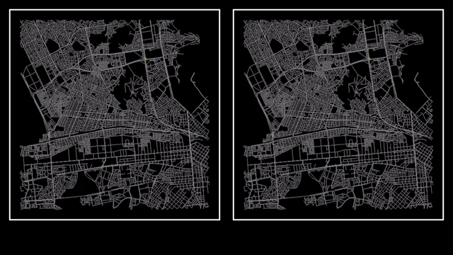

# Algoritmo_A_Estrella

## A* vs Dijkstra

> **Nota:** Ambos algoritmos visitan 30 nodos por cada iteración del *mainloop* (se puede modificar). La diferencia que se tiene que considerar es la proporción entre los tiempos y no los tiempos en si. Tiempo real: A* -> 0.016583s / Dijkstra -> 0.101573s

## *To-Do*
+ [x] ~~Implenentar el algoritmo A+~~
+ [x] ~~Mostrar el camino al final del algoritmo en lugar de todos los arcos recorridos.~~
+ [x] ~~Reinicializar las variables (ej. Nodo.g = INF) y limpiar los contenedores (ej. nodosVisitados) para ejecutar el algoritmo varias veces.~~
+ [ ] Hacer que el nodo incial y el nodos final sean visibles sin importar la perspectiva (sf::View).
+ [ ] Añadir efectos visuales (*shaders*) utilizando *GLSL*.
